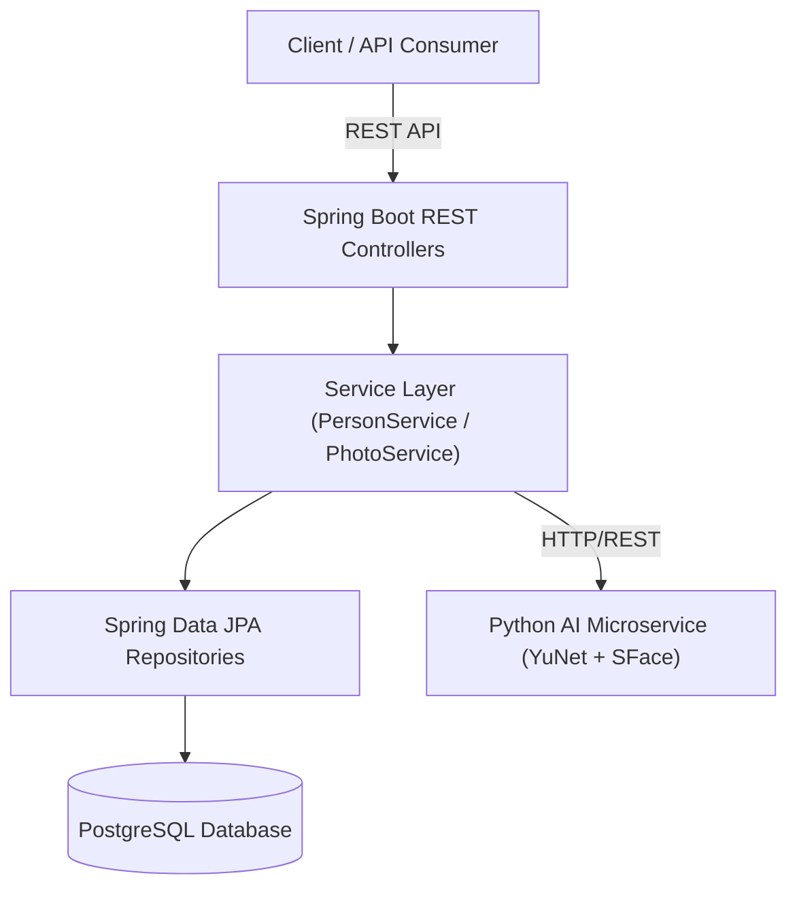

# 🎯 Photo Intelligence — Privacy-First Local Photo & Face Intelligence System

A high-performance, **privacy-first local photo intelligence backend** built with **Kotlin**, **Spring Boot 3 / 4**, **PostgreSQL**, and **OpenCV / ONNX AI Service**. 

The system indexes local photo collections, detects face occurrences, performs vector similarity embedding extraction, and clusters faces under persistent human identities — all processed locally without sending user media to external cloud services.

---

## 🌟 Core Features

### 👤 1. Person Identity Management
- **Permanent UUID Identity**: Assigns immutable, unique UUIDs (`id`) to human identities upon discovery or creation.
- **Human-Readable Tagging**: Supports updating and editing person names (`PATCH /api/persons/{id}`) while keeping the underlying UUID identity strictly unchanged.
- **Identity Search**: Fast case-insensitive name search for quick identity lookup (`GET /api/persons/search?name=...`).

### 📸 2. Privacy-First Photo Metadata Indexing
- **Local Reference Indexing**: Stores only photo file paths and metadata in PostgreSQL (`photos` table). Raw photo  binaries are never uploaded or stored in the database.
- **Photo-to-Person Mapping**: Seamlessly retrieves all distinct photos containing a specific person (`GET /api/persons/{id}/photos`).

### 🔍 3. Face Record Extraction & Vector Embeddings
- **Per-Occurrence Tracking**: Detects and records every individual face occurrence (`face_records` table) extracted from processed photos.
- **Deep Feature Representation**: Stores face crop locations, bounding boxes, detection confidence, and 128-dimensional embedding vectors extracted by OpenCV ONNX SFace model.

### 🤖 4. AI-Powered Local Microservice (YuNet + SFace)
- **Fast Face Detection**: Uses YuNet ONNX model for high-precision real-time face detection on local CPU.
- **Cosine Embedding Matching**: Matches detected face embeddings against existing person clusters using vector similarity to assign person identities automatically.

---

## 🏗 System Architecture



---

## 📊 Core Data Model

```
       +------------------+
       |      PERSON      |
       +------------------+
       | id (UUID)        |
       | name             |
       | createdAt        |
       | updatedAt        |
       +--------+---------+
                |
                | 1
                |
                | *
       +--------+---------+                 +------------------+
       |   FACE_RECORD    |                 |      PHOTO       |
       +------------------+                 +------------------+
       | id (UUID)        |                 | id (UUID)        |
       | personId (FK) ---+---------------->| filePath         |
       | photoId (FK)  ---+---------------->| originalFileName |
       | faceImagePath    | *             1 | createdAt        |
       | confidence       |                 +------------------+
       | similarity       |
       | embedding        |
       | createdAt        |
       +------------------+
```

---

## 🚀 REST API Endpoints

### 🩺 System Health
| Method | Endpoint | Description |
| :--- | :--- | :--- |
| `GET` | `/api/health` | Returns backend operational status (`"status": "UP"`) |

### 👤 Person Management APIs
| Method | Endpoint | Request Body / Query Params | Description |
| :--- | :--- | :--- | :--- |
| `POST` | `/api/persons` | `{"name": "Sayan"}` | Create a new person identity |
| `GET` | `/api/persons/{id}` | N/A | Get person details by UUID |
| `PATCH` | `/api/persons/{id}` | `{"name": "Sayan Paul"}` | Update person name (UUID remains unchanged) |
| `GET` | `/api/persons` | N/A | List all registered persons |
| `GET` | `/api/persons/search` | `?name=Sayan` | Search persons by case-insensitive name match |
| `GET` | `/api/persons/{id}/faces` | N/A | Get all face records extracted for a person |
| `GET` | `/api/persons/{id}/photos` | N/A | Get distinct photos containing the specified person |

---

## 🛠 Tech Stack

- **Backend**: Kotlin, Spring Boot 4.1, Spring Data JPA, Hibernate ORM
- **Database**: PostgreSQL 18+ JDBC Driver
- **AI Microservice**: Python 3.10+, OpenCV, ONNX Runtime (YuNet + SFace)
- **Build & Test**: Gradle Kotlin DSL, JUnit 5, Spring Boot Test

---

## 🧪 Setup & Running Locally

### Prerequisites
- Java 21+ / Java 25
- PostgreSQL Server running locally or in Docker
- Gradle 9.7+ (via `./gradlew`)

### 1. Database Configuration
Configure environment variables or default settings in `src/main/resources/application.properties`:
```properties
spring.datasource.url=${DB_URL:jdbc:postgresql://localhost:5432/photo_intelligence_db}
spring.datasource.username=${DB_USERNAME:postgres}
spring.datasource.password=${DB_PASSWORD:postgres}
```

### 2. Run Tests
```bash
./gradlew test
```

### 3. Start Application
```bash
./gradlew bootRun
```

Verify backend health:
```bash
curl http://localhost:8080/api/health
```

---

## 📄 License
Distributed under the MIT License.
